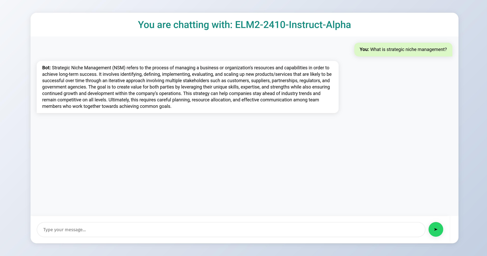

# OpenAI compatible server.

Host any model that's compatible with huggingface text-generation pipeline as an OpenAI compatible server. This project does not aim to replace tools such as vLLM, llama.cpp, etc. Instead, this software is intended serve models that are not (yet) supported by these frameworks. 

## Implemented endpoints

* `/v1/chat/completion`: Endpoint for text generation. Accepts the following parameters:
    - messages
    - frequency_penalty
    - max_completion_tokens
    - temperature
    - top_p

* `/v1/models`: Endpoint to list available models. Usefull for integration with front-ends such as open-webui.

* `/v1/models/MODEL_NAME`: Endpoint to list model specs

## Usage

### Install
```bash
git clone https://github.com/njelicic/openai-server/
cd openai-server
pip3 install -r requirements.txt
```

### Start server

Run main.py to start the server. The CLI accepts the following arguments:
* `--model-name`: The name of the model hosted on the Huggingface hub
* `--host`: Host IP adress of the server
* `--port`: Post of the server
* `--hf-token`: Your Huggingface token, nessecary to access restricted models such as Llama.
* `--quantization`: BnB quantization strategy. Can be "4bit", "8bit" or "None"

#### Example usage
```bash
python3 main.py \
--model-name "ecdaadmin/ELM2-2410-Instruct-Alpha" \
--host 127.0.0.1 \
--port 8000 \
--hf_token "hf_my-secret-token" \
--quantization="4bit"
```

### Chat Interface
Navigate in the browser to `http://127.0.0.1:8000/chat` and start an interactive chat session with the model. 



### CURL

```bash
curl http://127.0.0.1:8000/v1/chat/completions \
    -H "Content-Type: application/json" \
    -d '{
            "messages": [
                {"role": "user", "content": "What is diabetes?"}
            ]
        }'
```

### OpenAI Python client

The server can be access via the OpenAI Python client. Ensure that the `base_url` points to the host and port. Note, `api_key` and `model` are required by the OpenAI client, however, they are unused by the server. 

```python
from openai import OpenAI

client = OpenAI(
    base_url="http://127.0.0.1:8000/v1",
    api_key='not-required',
)

prompt = 'What is diabetes?'

completion = client.chat.completions.create(
    model='not-required',
    messages=[
        {"role": "user", "content": prompt}
    ],
    temperature=0.8
).choices[0].message.content
```


